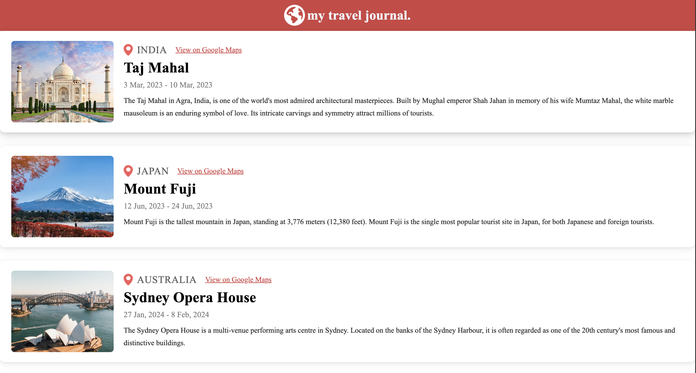
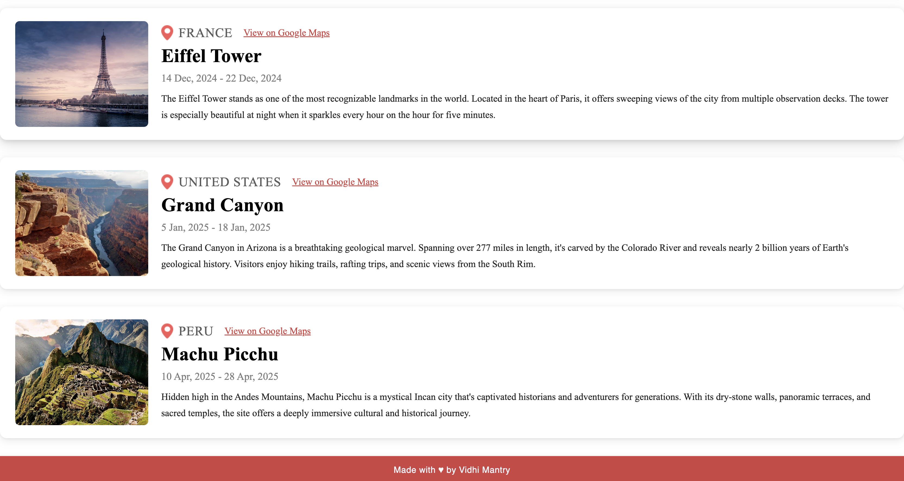
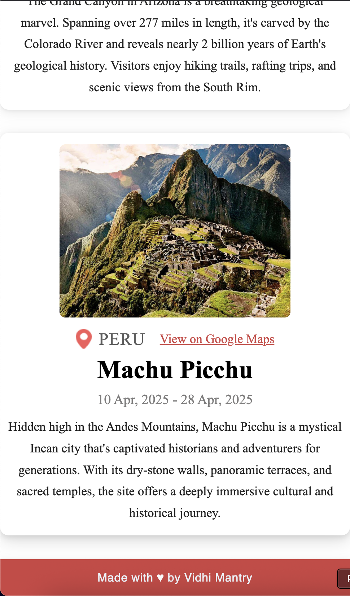

# 🌍 Travel Journal

An interactive React app that lets users create, view, and delete travel entries — perfect for recording past adventures or planning new ones! Each trip includes a destination name, image, travel dates, description, and a Google Maps link. The app features a clean, card-based layout and adapts seamlessly to both desktop and mobile screens.

---

## 🛠️ Features

- 📌 **Add New Trips**: Input destination name, image URL, travel dates, description, and location link via a simple form  
- ❌ **Delete Trips**: Instantly remove any travel entry using a delete button  
- 💾 **Data Persistence**: All trips are saved to `localStorage`, so entries remain intact even after refreshing the browser  
- 🗂️ Trip entries are stored in an array and dynamically rendered using `map()`  
- 🔄 React state updates on every add/remove, keeping UI in sync with stored data  
- 💡 Uses props to pass trip details to reusable `Card` components — demonstrating component-driven design and one-way data flow  
- 🎨 Responsive, mobile-friendly layout with clean styling using CSS Flexbox  

---

## 📦 Tech Stack

- ⚛️ **React** – UI and interactivity  
- ⚡ **Vite** – Fast development and build tool  
- 💾 **localStorage** – Client-side data persistence  
- 🎨 **CSS** – Styling and responsive layout  

---

## 🖼️ Screenshots

### 🖥️ Desktop View





---

### 📱 Mobile View

<p>
  
  &nbsp;&nbsp;&nbsp;
  
</p>

---

## 🚀 Getting Started

### 1. Clone the repo

```bash
git clone https://github.com/vidhimantry/Travel-Journal.git
cd Travel-Journal
```

### 2. Install dependencies

```bash
npm start
```
### 3. Run the app locally

```bash
npm start
```
This will open the app at http://localhost:3000

---

## 🔮 Future Enhancements

The following improvements are planned for future iterations of the project:

- **Search and Filter Functionality**: Allow users to filter entries by location, date, or keywords.
- **Backend Connectivity**: Store and retrieve journal entries using a database service such as Firebase or MongoDB.
- **Interactive Map Integration**: Display markers for each destination using the Google Maps API.
- **Theme Support**: Implement light and dark mode toggling for better accessibility and user preference.
- **Progressive Web App (PWA)**: Add offline capabilities and installability on mobile devices.


